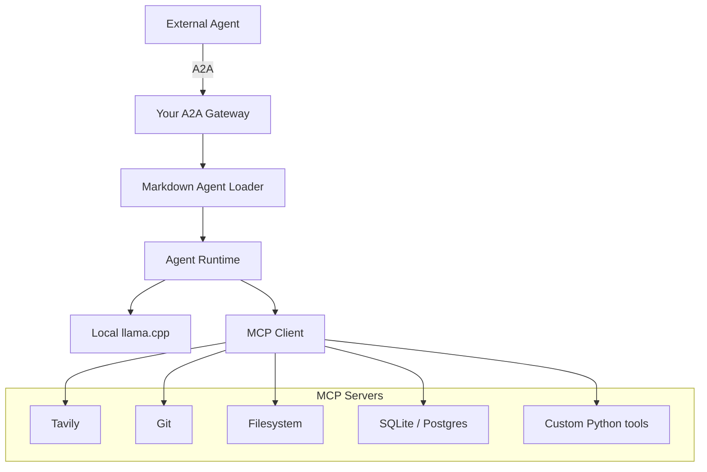

# Agent Runtime

A local-first agent runtime that exposes agents over the A2A (Agent-to-Agent) protocol, loads agent definitions from Markdown, and executes them against a local LLM with tool access via MCP (Model Context Protocol).

## Architecture



## Components

- **A2A Gateway** — Entry point for external agents. Speaks the [A2A protocol](https://google.github.io/A2A/) and routes requests into the runtime.
- **Markdown Agent Loader** — Parses agent definitions authored in Markdown (persona, instructions, tool bindings) into runtime-ready configs.
- **Agent Runtime** — Orchestrates a loaded agent: manages conversation state, dispatches inference calls, and mediates tool use.
- **Local llama.cpp** — On-device inference backend; no external LLM API dependency.
- **MCP Client** — Connects the runtime to one or more MCP servers, exposing their tools to the agent during execution.
- **MCP Servers**:
  - **Tavily** — Web search.
  - **Git** — Repository operations.
  - **Filesystem** — Local file read/write.
  - **SQLite/Postgres** — Structured data access.
  - **Custom Python tools** — Project-specific tool implementations.

## Request Flow

1. An external agent sends a request over A2A to the gateway.
2. The gateway resolves and hands off to the Markdown Agent Loader, which loads the target agent's definition.
3. The Agent Runtime executes the agent's logic, calling the local llama.cpp backend for inference.
4. When the agent needs a tool, the runtime calls out through the MCP Client to the relevant MCP server (Tavily, Git, Filesystem, SQLite/Postgres, or a custom Python tool).
5. Results flow back up through the runtime, gateway, and A2A response to the external agent.

## Status

A working pipeline is implemented in `agent_runtime/`, serving one or more agents from a single gateway process:

- **Markdown Agent Loader** (`loader.py`) — parses agent `.md` files in the exact frontmatter format used by Claude Code / Cowork subagents (`name`, `description`, `tools`, `model` + a Markdown body used as the system prompt). Eight real examples are bundled in `agents/`, including a handful shaped around ODC/Salesforce call patterns: `contract-reviewer`, `support-ticket-triage`, `sales-followup-drafter`, `meeting-notes-summarizer`, `knowledge-base-assistant`, plus `code-reviewer` and `security-reviewer`. `swarm-hr-assistant` demonstrates a domain-specific MCP server (Near Partner's internal Swarm HR API, `swarmmcp` — a sibling project, not bundled here) whose tool names (`GetMyProfile`, `GetMyVacations`) aren't Claude-Code-shaped at all — `tool_aliases` keys are opaque strings, not a fixed enum.
- **Tool mapping** (`tool_mapping.py`) — maps the Claude Code tool names an agent asks for (`Read`, `Write`, `Edit`, `Glob`, ...) onto whatever MCP servers are configured. `Bash` and a few other tools are hard-blocked from ever being exposed over A2A, regardless of configuration — see "Security notes" below.
- **MCP Client** (`mcp_client.py`) — connects to one or more MCP servers over stdio (via the official `mcp` Python SDK) and exposes their tools under those Claude Code names.
- **Agent Runtime** (`runtime.py`) — the tool-calling loop: builds the message list from the agent's system prompt, calls the LLM, executes any tool calls via MCP, feeds results back, repeats (capped at 8 iterations). It's agent-agnostic per call, so one runtime instance (and one shared MCP connection pool) serves every agent.
- **llama-server client** (`llm_client.py`) — talks to llama.cpp's `llama-server` over its OpenAI-compatible `/v1/chat/completions` endpoint, including `tools`/`tool_calls`.
- **A2A Gateway** (`a2a_gateway.py`) — built on the official `a2a-sdk` (0.3.x). Every agent found in `agents/` gets its own Agent Card and JSON-RPC endpoint, mounted under `/agents/<name>/...` on a single FastAPI app/port (see "Multiple agents, one gateway" below). A `GET /agents` index lists what's mounted.

This has been validated with real HTTP round trips against two agents served from the same process: `GET /agents` → per-agent Agent Card → `message/send` → runtime → a genuine MCP filesystem server tool call → LLM → completed A2A `Task`, each agent answering independently. Unit tests cover the loader, tool mapping (including the security block), the runtime's tool-call loop, and the gateway's per-agent routing (`tests/`).

It has also been validated end-to-end against a real OutSystems ODC chat agent (via a tunneled gateway): ODC fetched an Agent Card, sent a `message/send` call with a real meeting transcript, the runtime ran it through the local LLM, and the structured summary was rendered back in ODC's chat UI. Two ODC-specific integration issues surfaced and are documented in "Connecting from OutSystems ODC" below (`AGENT_RUNTIME_PUBLIC_URL` reachability, and forcing ODC's `taskId` parameter empty) — both are configuration/deployment gotchas, not bugs in this runtime. Every A2A request/response and tool call is now logged (see `a2a_gateway.py`/`runtime.py`) to make diagnosing future integration issues faster: at the default `INFO` level only sizes, tool names, and outcomes are logged; set `AGENT_RUNTIME_LOG_LEVEL=DEBUG` to additionally log full request/response/tool-call content, which can include sensitive data and should only be used for local debugging.

`message/stream` works — every Agent Card advertises `capabilities.streaming=True`, and a streaming client sees the same `working` → `artifact` → `completed` events a `tasks/get` poller would, pushed over SSE instead of pulled. It streams task-state transitions, not LLM tokens: the tool-calling loop only produces user-facing text on its final turn, so there's no partial-text-as-it-generates experience yet — that would need `llm_client.py` to consume llama-server's own SSE mode, a bigger change with no current consumer (OutSystems ODC renders only inline Messages and doesn't call `message/stream`). Task state also now survives a gateway restart via `SQLiteTaskStore` (`AGENT_RUNTIME_TASK_STORE_PATH`, default `state/tasks.db`) instead of being lost with the old in-memory-only store.

Not yet built (natural next steps once this is validated against your real agents and a real model): additional MCP servers (Tavily, Git, SQLite/Postgres, custom Python tools) beyond the filesystem example, token-level LLM streaming, and authentication on the A2A endpoint itself.

## Multiple agents, one gateway

A2A itself has no concept of "many agents behind one URL" — an Agent Card describes exactly one agent at exactly one RPC url, and its `skills` list is for discovery only (there's no field in `message/send` to pick a skill/agent at request time). So this runtime hosts every agent it finds under its own sub-path instead:

```
http://host:9000/agents/code-reviewer/.well-known/agent-card.json      (Agent Card)
http://host:9000/agents/code-reviewer/                                  (RPC endpoint)
http://host:9000/agents/security-reviewer/.well-known/agent-card.json
http://host:9000/agents/security-reviewer/
http://host:9000/agents                                                 (index of everything mounted)
```

One process, one port, one base URL to expose — but each agent stays independently, spec-correctly addressable. From OutSystems ODC's side this means registering one "external agent" connector per markdown agent, pointed at that agent's own Agent Card URL, rather than trying to reach several agents through a single connector.

By default every `.md` file in `agents/` is mounted. Set `AGENT_RUNTIME_AGENT_NAMES` (comma-separated) to expose only a subset.

## Quickstart

```bash
pip install -e ".[dev]"

# 1. llama.cpp: a model that supports tool calling (Qwen2.5-Instruct, Llama-3.1-Instruct,
#    Hermes-2-Pro, ...), served with --jinja so tool_calls are parsed from the response.
./scripts/run_llama_server.sh /path/to/model.gguf

# 2. Configure which MCP servers back which Claude Code tools.
cp config/mcp_servers.example.json config/mcp_servers.json
cp config/.env.example config/.env
# mcp_servers.json's filesystem server args already use the {WORKING_DIR}
# placeholder — set AGENT_RUNTIME_WORKING_DIR in .env to the one directory
# these agents may Read/Write/Edit/Glob (never the repo root: the gateway
# refuses to start if it overlaps config/, which holds your secrets).
# By default every agent in agents/ is served; set AGENT_RUNTIME_AGENT_NAMES
# to a comma-separated list to expose only a subset.

# 3. Serve every agent in agents/ over A2A.
./scripts/run_gateway.sh
```

On Windows, use the PowerShell equivalents instead: `.\scripts\run_llama_server.ps1` and `.\scripts\run_gateway.ps1`.

Then, from anywhere that can reach the gateway:

```bash
curl http://localhost:9000/agents  # which agents are mounted, and their Agent Card URLs

curl http://localhost:9000/agents/code-reviewer/.well-known/agent-card.json

curl -X POST http://localhost:9000/agents/code-reviewer/ -H "Content-Type: application/json" -d '{
  "id": "1", "jsonrpc": "2.0", "method": "message/send",
  "params": {"message": {"kind": "message", "messageId": "m1", "role": "user",
    "parts": [{"kind": "text", "text": "review app.py"}]}}
}'
```

Run the test suite with `pytest`.

## Adding your own agents

Drop a `.md` file in `agents/`, named `<agent-name>.md`, in the same format Claude Code/Cowork subagents already use:

```markdown
---
name: my-agent
description: When this agent should be used.
tools: Read, Glob
model: local
---

The agent's system prompt goes here, exactly like a Claude Code subagent.
```

It's picked up automatically the next time the gateway starts (or restrict to specific agents with `AGENT_RUNTIME_AGENT_NAMES`). If `tools` is omitted, the agent inherits every tool this runtime currently has connected via MCP — the same "inherit all tools" convention Claude Code uses.

## Wiring more MCP servers

Add an entry to `mcp_servers.json` per server, declaring which Claude Code tool names it backs and under what real MCP tool name:

```json
{
  "name": "git",
  "command": "mcp-server-git",
  "args": ["--repository", "/path/to/repo"],
  "tool_aliases": { "Bash": "git_diff" }
}
```

(That last example is illustrative only — see "Security notes": `Bash` specifically can never be re-enabled this way, on purpose.)

If you use `npx -y <package>` to run a server, be aware that in some sandboxed/proxied environments `npx` can hang on its own registry/version check even with the package cached, while an `npm install -g`'d binary invoked directly starts instantly — that's what `mcp_servers.example.json` recommends by default.

## Connecting from OutSystems ODC

For each markdown agent you want to expose, register a separate ODC external agent connector pointed at that agent's own Agent Card URL — e.g. `https://your-host:9000/agents/code-reviewer/.well-known/agent-card.json` — not at the gateway's bare base URL (`AGENT_RUNTIME_PUBLIC_URL`). ODC should be able to fetch that card and call `message/send` against the matching RPC endpoint per the A2A spec. These agents advertise `capabilities.streaming: true`, but use ODC's non-streaming/synchronous call path regardless — ODC's chat UI renders only inline Messages and doesn't call `message/stream`, so there's nothing to gain from it here. You'll need the gateway reachable from ODC — for Near's own on-prem `llama.cpp` box that most likely means a reverse proxy or tunnel exposing the gateway's port, which is a deployment detail worth nailing down before going further.

### Exposing a local gateway to ODC with Cloudflare Tunnel

For testing against real ODC before a permanent domain/reverse-proxy exists, [Cloudflare Tunnel](https://developers.cloudflare.com/cloudflare-one/connections/connect-networks/) can punch a public HTTPS URL through to a gateway running on your own machine, with no account or DNS setup required for a quick/ad-hoc tunnel.

1. **Install `cloudflared`:**
   - Windows: `winget install --id Cloudflare.cloudflared -e` (installs to `C:\Program Files (x86)\cloudflared\cloudflared.exe`)
   - macOS: `brew install cloudflared`
   - Linux: see [Cloudflare's install docs](https://developers.cloudflare.com/cloudflare-one/connections/connect-networks/downloads/)

2. **Start the gateway first** (`./scripts/run_gateway.sh` or `.\scripts\run_gateway.ps1` on Windows), listening on its default port 9000.

3. **Start a quick tunnel pointed at the gateway:**
   ```bash
   cloudflared tunnel --url http://localhost:9000
   ```
   This prints a random public URL like `https://some-random-words.trycloudflare.com` within a few seconds. Leave this process running — closing it tears down the tunnel.

4. **Point `AGENT_RUNTIME_PUBLIC_URL` at that tunnel URL and restart the gateway** — this step is not optional. The Agent Card's `url` field is baked in at gateway startup (see the `AGENT_RUNTIME_PUBLIC_URL` note above), so ODC will only be able to complete "Test Connection" (not just "Get Details") once the gateway has been restarted with the tunnel's actual URL set:
   ```
   AGENT_RUNTIME_PUBLIC_URL=https://some-random-words.trycloudflare.com/
   ```

5. **Register the ODC connector** against `https://some-random-words.trycloudflare.com/agents/<agent-name>/.well-known/agent-card.json`.

Notes:
- A `trycloudflare.com` quick tunnel is unauthenticated, has no uptime guarantee, and gets a **new random URL every time `cloudflared` restarts** — expect to update `AGENT_RUNTIME_PUBLIC_URL` and restart the gateway again after any tunnel restart. It's meant for short-lived testing, not a permanent setup.
- For a stable long-term URL, use a [named Cloudflare Tunnel](https://developers.cloudflare.com/cloudflare-one/connections/connect-networks/get-started/create-remote-tunnel/) tied to a domain you control. This runtime is not deployed to Hetzner (no GPU there for llama.cpp) — it runs permanently on the local GPU machine, reached via tunnel, not migrated to a server.
- Any tunnel provider works the same way in principle (ngrok is a common alternative) — the only thing that matters to this runtime is that `AGENT_RUNTIME_PUBLIC_URL` matches whatever public URL is currently active.

**`AGENT_RUNTIME_PUBLIC_URL` must be the address ODC (not you) can reach.** Every Agent Card's `url` field — the RPC endpoint ODC actually connects to — is built from `AGENT_RUNTIME_PUBLIC_URL` once at gateway startup; it's never inferred from the request. If this is still `http://localhost:9000/` while the gateway is exposed through ngrok, Cloudflare Tunnel, or a reverse proxy, ODC's "Get Details" (which just fetches the Agent Card) will succeed, but "Test Connection" (which connects to the card's `url`) will fail with a generic connection error — because it's trying to reach ODC's own `localhost`, not your machine. Whenever the public URL changes, update `AGENT_RUNTIME_PUBLIC_URL` in `config/.env` and restart the gateway.

**In ODC's tool/action settings for this agent, force the `taskId` parameter to always send empty.** ODC's own orchestrating LLM will sometimes populate the optional `taskId` parameter on its `message/send` tool call with a self-invented, non-UUID string (observed: it reused the action's own name, e.g. `summarize-meeting-notes`) even on a brand-new conversation turn. The A2A SDK's `DefaultRequestHandler` treats any `taskId` as a reference to an *existing* task and hard-rejects one it doesn't recognize with JSON-RPC error `-32001 Task <id> was specified but does not exist` — there is no server-side setting to relax this, since it's spec-mandated task-continuation behavior, not a bug in this gateway. Symptom in ODC chat: the agent replies "task is currently in progress... check back later" and never surfaces the actual answer, because the call failed before your agent ever ran. Fix on the ODC side: configure the `taskId` parameter to always be sent empty rather than left to the LLM's discretion.

## Security notes

- `Bash` (and a handful of other Claude Code tools with no safe MCP equivalent — see `tool_mapping.UNSUPPORTED_TOOLS`) is never exposed to an agent over this gateway, even if an agent's frontmatter requests it and even if a misconfigured `mcp_servers.json` tries to map it — this is enforced in code, not just by omission.
- MCP server subprocesses are spawned with a minimal environment (no ambient credentials from this process), with only proxy variables (`HTTP_PROXY`/`HTTPS_PROXY`/`NO_PROXY`) passed through so package runners work behind a corporate proxy.
- The filesystem MCP server is scoped to `AGENT_RUNTIME_WORKING_DIR` (via the `{WORKING_DIR}` placeholder in `mcp_servers.json`) — the sandbox boundary for `Read`/`Write`/`Edit`/`Glob`. This is enforced, not just advisory: the gateway refuses to start (`SystemExit`) if `AGENT_RUNTIME_WORKING_DIR` overlaps `config/`, which holds `.env` and `mcp_servers.json`. Never point it at the repo root.
- MCP tool calls are bounded by `AGENT_RUNTIME_MCP_TIMEOUT` — a hung or slow MCP server subprocess surfaces as a normal tool error instead of stalling the shared connection pool (and therefore every agent) indefinitely.
- `AGENT_RUNTIME_TASK_STORE_PATH` (default `state/tasks.db`) persists full task content — user messages, agent responses, artifacts — the same category of sensitive data as `AGENT_RUNTIME_LOG_LEVEL=DEBUG` logs. Keep it untracked (already gitignored via `state/`) and access-controlled like `config/.env`.
- There is currently no authentication on the A2A endpoint itself; put it behind network-level access control (VPN, firewall rules, reverse-proxy auth) before exposing it beyond a trusted network, especially once reachable from ODC.
