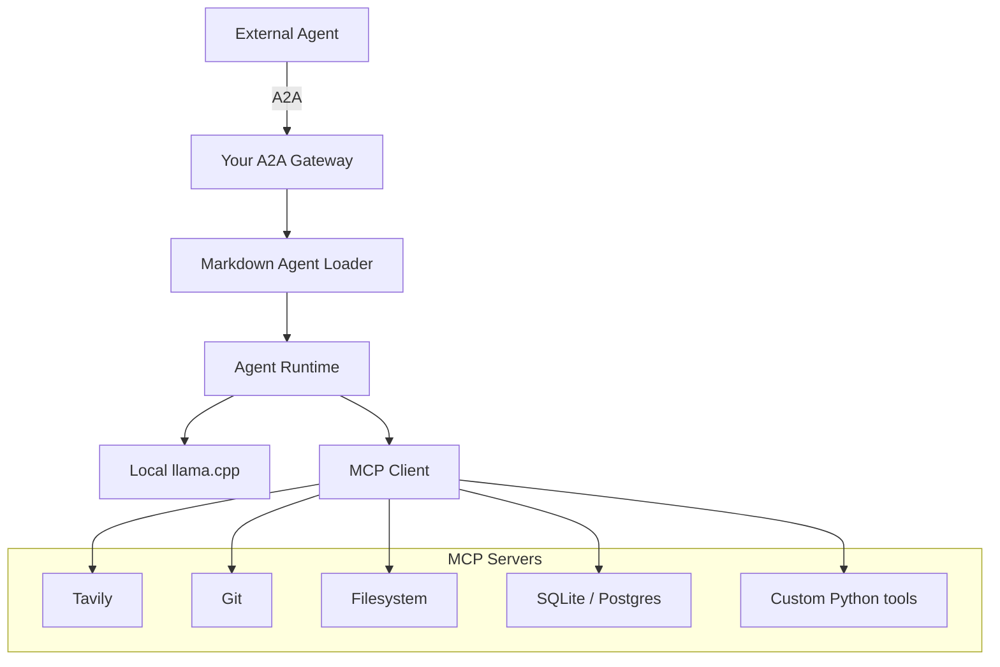

# Agent Runtime

A local-first agent runtime that exposes agents over the A2A (Agent-to-Agent) protocol, loads agent definitions from Markdown, and executes them against a local LLM with tool access via MCP (Model Context Protocol).

## Architecture

## Components

- **A2A Gateway** — Entry point for external agents. Speaks the [A2A protocol](https://google.github.io/A2A/) and routes requests into the runtime.
- **Markdown Agent Loader** — Parses agent definitions authored in Markdown (persona, instructions, tool bindings) into runtime-ready configs.
- **Agent Runtime** — Orchestrates a loaded agent: manages conversation state, dispatches inference calls, and mediates tool use.
- **Local llama.cpp** — On-device inference backend; no external LLM API dependency.
- **MCP Client** — Connects the runtime to one or more MCP servers, exposing their tools to the agent during execution.
- **MCP Servers**:
  - **Tavily** — Web search.
  - **Git** — Repository operations.
  - **Filesystem** — Local file read/write.
  - **SQLite/Postgres** — Structured data access.
  - **Custom Python tools** — Project-specific tool implementations.

## Request Flow

1. An external agent sends a request over A2A to the gateway.
2. The gateway resolves and hands off to the Markdown Agent Loader, which loads the target agent's definition.
3. The Agent Runtime executes the agent's logic, calling the local llama.cpp backend for inference.
4. When the agent needs a tool, the runtime calls out through the MCP Client to the relevant MCP server (Tavily, Git, Filesystem, SQLite/Postgres, or a custom Python tool).
5. Results flow back up through the runtime, gateway, and A2A response to the external agent.
