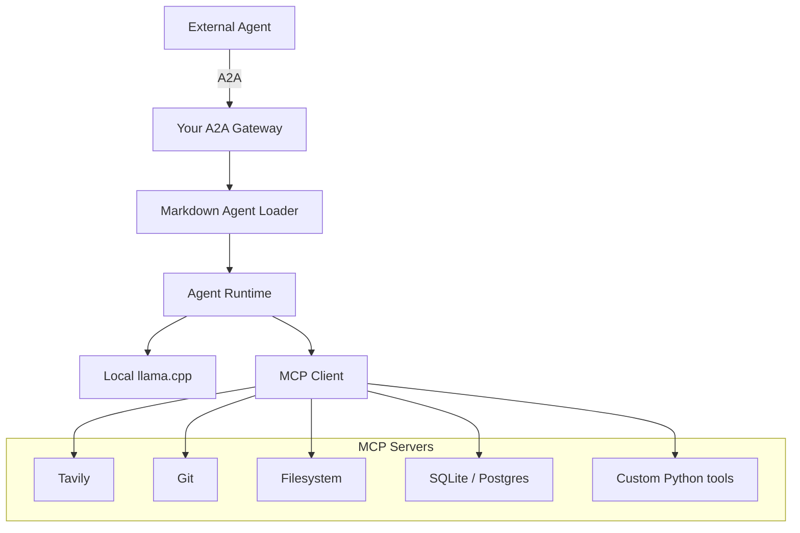

# Agent Runtime

A local-first agent runtime that exposes agents over the A2A (Agent-to-Agent) protocol, loads agent definitions from Markdown, and executes them against a local LLM with tool access via MCP (Model Context Protocol).

## Architecture



## Components

- **A2A Gateway** — Entry point for external agents. Speaks the [A2A protocol](https://google.github.io/A2A/) and routes requests into the runtime.
- **Markdown Agent Loader** — Parses agent definitions authored in Markdown (persona, instructions, tool bindings) into runtime-ready configs.
- **Agent Runtime** — Orchestrates a loaded agent: manages conversation state, dispatches inference calls, and mediates tool use.
- **Local llama.cpp** — On-device inference backend; no external LLM API dependency.
- **MCP Client** — Connects the runtime to one or more MCP servers, exposing their tools to the agent during execution.
- **MCP Servers**:
  - **Tavily** — Web search.
  - **Git** — Repository operations.
  - **Filesystem** — Local file read/write.
  - **SQLite/Postgres** — Structured data access.
  - **Custom Python tools** — Project-specific tool implementations.

## Request Flow

1. An external agent sends a request over A2A to the gateway.
2. The gateway resolves and hands off to the Markdown Agent Loader, which loads the target agent's definition.
3. The Agent Runtime executes the agent's logic, calling the local llama.cpp backend for inference.
4. When the agent needs a tool, the runtime calls out through the MCP Client to the relevant MCP server (Tavily, Git, Filesystem, SQLite/Postgres, or a custom Python tool).
5. Results flow back up through the runtime, gateway, and A2A response to the external agent.

## Status

A working v1 pipeline is implemented in `agent_runtime/`, scoped to a single agent end to end:

- **Markdown Agent Loader** (`loader.py`) — parses agent `.md` files in the exact frontmatter format used by Claude Code / Cowork subagents (`name`, `description`, `tools`, `model` + a Markdown body used as the system prompt). A real example is bundled at `agents/code-reviewer.md`.
- **Tool mapping** (`tool_mapping.py`) — maps the Claude Code tool names an agent asks for (`Read`, `Write`, `Edit`, `Glob`, ...) onto whatever MCP servers are configured. `Bash` and a few other tools are hard-blocked from ever being exposed over A2A, regardless of configuration — see "Security notes" below.
- **MCP Client** (`mcp_client.py`) — connects to one or more MCP servers over stdio (via the official `mcp` Python SDK) and exposes their tools under those Claude Code names.
- **Agent Runtime** (`runtime.py`) — the tool-calling loop: builds the message list from the agent's system prompt, calls the LLM, executes any tool calls via MCP, feeds results back, repeats (capped at 8 iterations).
- **llama-server client** (`llm_client.py`) — talks to llama.cpp's `llama-server` over its OpenAI-compatible `/v1/chat/completions` endpoint, including `tools`/`tool_calls`.
- **A2A Gateway** (`a2a_gateway.py`) — built on the official `a2a-sdk` (0.3.x). Publishes an Agent Card at `/.well-known/agent-card.json` and a JSON-RPC endpoint (`message/send`, `tasks/get`, ...) that runs the loaded agent per request.

This has been validated with a real HTTP round trip: A2A `message/send` request → gateway → runtime → a genuine MCP filesystem server tool call → LLM → completed A2A `Task` with the result as an artifact. Unit tests cover the loader, tool mapping (including the security block), the runtime's tool-call loop, and the gateway's request/response contract (`tests/`).

Not yet built (natural next steps once v1 is validated against your real agents and a real model): serving more than one agent from a single gateway process, additional MCP servers (Tavily, Git, SQLite/Postgres, custom Python tools) beyond the filesystem example, and streaming (`message/stream`) responses.

## Quickstart

```bash
pip install -e ".[dev]"

# 1. llama.cpp: a model that supports tool calling (Qwen2.5-Instruct, Llama-3.1-Instruct,
#    Hermes-2-Pro, ...), served with --jinja so tool_calls are parsed from the response.
./scripts/run_llama_server.sh /path/to/model.gguf

# 2. Configure which MCP servers back which Claude Code tools.
cp config/mcp_servers.example.json config/mcp_servers.json
cp config/.env.example config/.env
# edit both: point the filesystem server at the directory this agent may read,
# and set AGENT_RUNTIME_AGENT_NAME to the agent you want to serve.

# 3. Serve the agent over A2A.
./scripts/run_gateway.sh
```

Then, from anywhere that can reach the gateway:

```bash
curl http://localhost:9000/.well-known/agent-card.json

curl -X POST http://localhost:9000/ -H "Content-Type: application/json" -d '{
  "id": "1", "jsonrpc": "2.0", "method": "message/send",
  "params": {"message": {"kind": "message", "messageId": "m1", "role": "user",
    "parts": [{"kind": "text", "text": "review app.py"}]}}
}'
```

Run the test suite with `pytest`.

## Adding your own agents

Drop a `.md` file in `agents/`, named `<agent-name>.md`, in the same format Claude Code/Cowork subagents already use:

```markdown
---
name: my-agent
description: When this agent should be used.
tools: Read, Glob
model: local
---

The agent's system prompt goes here, exactly like a Claude Code subagent.
```

Point `AGENT_RUNTIME_AGENT_NAME` at it. If `tools` is omitted, the agent inherits every tool this runtime currently has connected via MCP — the same "inherit all tools" convention Claude Code uses.

## Wiring more MCP servers

Add an entry to `mcp_servers.json` per server, declaring which Claude Code tool names it backs and under what real MCP tool name:

```json
{
  "name": "git",
  "command": "mcp-server-git",
  "args": ["--repository", "/path/to/repo"],
  "tool_aliases": { "Bash": "git_diff" }
}
```

(That last example is illustrative only — see "Security notes": `Bash` specifically can never be re-enabled this way, on purpose.)

If you use `npx -y <package>` to run a server, be aware that in some sandboxed/proxied environments `npx` can hang on its own registry/version check even with the package cached, while an `npm install -g`'d binary invoked directly starts instantly — that's what `mcp_servers.example.json` recommends by default.

## Connecting from OutSystems ODC

Point the ODC external agent connector at this gateway's public URL (`AGENT_RUNTIME_PUBLIC_URL`, e.g. `https://your-host:9000/`). ODC should be able to fetch the Agent Card from `/.well-known/agent-card.json` and call `message/send` per the A2A spec. Since this gateway currently declares `streaming: false`, use ODC's non-streaming/synchronous call path. You'll need this gateway reachable from ODC — for Near's own on-prem `llama.cpp` box that most likely means a reverse proxy or tunnel exposing the gateway's port, which is a deployment detail worth nailing down before going further.

## Security notes

- `Bash` (and a handful of other Claude Code tools with no safe MCP equivalent — see `tool_mapping.UNSUPPORTED_TOOLS`) is never exposed to an agent over this gateway, even if an agent's frontmatter requests it and even if a misconfigured `mcp_servers.json` tries to map it — this is enforced in code, not just by omission.
- MCP server subprocesses are spawned with a minimal environment (no ambient credentials from this process), with only proxy variables (`HTTP_PROXY`/`HTTPS_PROXY`/`NO_PROXY`) passed through so package runners work behind a corporate proxy.
- The filesystem MCP server should always be scoped to the narrowest directory an agent actually needs — it's the sandbox boundary for `Read`/`Write`/`Edit`/`Glob`.
- There is currently no authentication on the A2A endpoint itself; put it behind network-level access control (VPN, firewall rules, reverse-proxy auth) before exposing it beyond a trusted network, especially once reachable from ODC.
